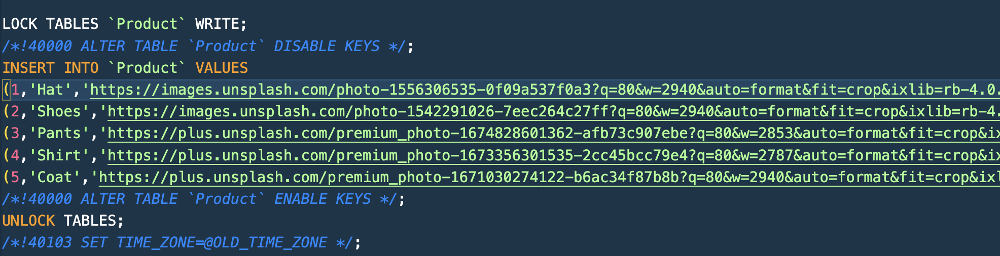

# Approach

### Task 1

#### `webapp/src/pages/ProductsPage/`

- Displayed the product info using Tailwind css.
- Fetched the product info using api/products.
- Added the storybook for the component in ProductsPage.stories.tsx.
- Added the test suite for the component in ProductsPage.test.tsx.

### Task 2

#### `api/products`

- Added endpoints for fetching the data from the Product schema and returns into JSON object for displaying at Frontend.
- Added seperate dockerfile for this service.
- Added test cases for the service.

### Task 3

#### `db/data.sql`

- Replaced the PhotoURLs of all the product with real photo URL.
  

### Handling Persistent Drag-and-Drop Order Updates

Update the `handleDragEnd` function in your `webapp/src/pages/HomePage/HomePage.tsx` to call the `updateOrderStatus`.
Here's the
updated code:

```typescript
const handleDragEnd = async (result: any) => {
    const {source, destination} = result;
    if (!destination) return;
    const sourceKey = ID_LIST_MAP[source.droppableId as keyof IdList] as keyof OrderData;
    const sourceIndex = source.index;

    const destKey = ID_LIST_MAP[destination.droppableId as keyof IdList] as keyof OrderData;
    const destIndex = destination.index;

    if (sourceKey === destKey) {
        const sourceClone = Array.from(data[sourceKey]);
        const [removed] = sourceClone.splice(sourceIndex, 1);
        sourceClone.splice(destIndex, 0, removed);
        setData({...data, [sourceKey]: sourceClone});
    } else {
        const sourceClone = Array.from(data[sourceKey]);
        const destClone = Array.from(data[destKey]);
        const [removed] = sourceClone.splice(sourceIndex, 1);
        destClone.splice(destIndex, 0, removed);
        destClone[destIndex].OrderStatus = destKey;

        // Update the order status on the server
        setLoadingState(DATA_STATES.waiting);
        const orderStatusUpdated = await updateOrderStatus(removed, destKey);
        if (orderStatusUpdated) {
            setData({
                ...data,
                [sourceKey]: sourceClone,
                [destKey]: destClone,
            });
            setLoadingState(DATA_STATES.loaded);
        }
    }
};
```